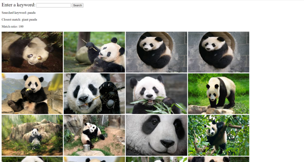

# Image Search with NLP

Nowadays, people are storing sheer volume of pictures on their devices, making it increasingly difficult  for them to find the specific image they're looking for. This project aims to simplify the process of image search by leveraging natural language processing (NLP) and image recognition techniques. The project involves developing an application that allows users to input a keyword and get a list of images that match the keyword. The application also features a UI web interface that allows users to scroll through the search results, zoom in on images, and view image metadata.

## Project Overview
The project follows the Model-View-Controller (MVC) architecture for separation of concerns. 
- **Model: predict_label.py**\
The predict_label.py file contains functions for loading a pre-trained MobileNetV2 model from TensorFlow Hub, preprocessing images for a given folder, feeding image vectors to the model, and predicting the label of an image using the loaded model. The resulting dictionary is labels (key) and a list of image paths (value) stored in a pickle file.
- **View: main.py**\
The main.py file contains the main Flask application that serves the UI for the image search. The application allows users to input a keyword and display a list of images that match the keyword on the default browser. 
- **Controller: app.py**\
The app.py file contains a function for finding images that match a given keyword based on the labels in the dictionary. It loads the dictionary from the label.pickle file and calculates the partial match ratio between the keyword and each label in the dictionary using the fuzzywuzzy library. The function returns the closest matching label along with its partial match ratio and a list of paths to the images with that label.

## Screenshot


## Usage
1. Clone the repository: 
```bash
git clone https://github.com/zhongzha/image_search_nlp.git
```
3. Open the terminal and navigate to the project folder
4. Create virtual environment to install dependencies:
```bash
 python -m venv myenv
 myenv\Scripts\activate 
  
 pip install -r requirements.txt
```
9. Preprocess the images (for the first time only):
```bash
python predict_label.py
```
11. Run the project:
```bash
python main.py
```
13. Open your web browser and navigate to http://127.0.0.1:5000/ to view the app.


## Limitations
The use of a pre-trained MobileNetV2 model and the fuzzywuzzy library can result in errors and inaccuracies in the image search. Especially when certain images are not part of the ImageNet dataset used to train the model. For example, in this program, a Alpaca was recognized as a cat. These limitations can result in incorrect or incomplete search results for the user.

## Contributors
Yuxuan Yang | yang8364@umn.edu\
Samson Zhang | zhongzha@andrew.cmu.edu

